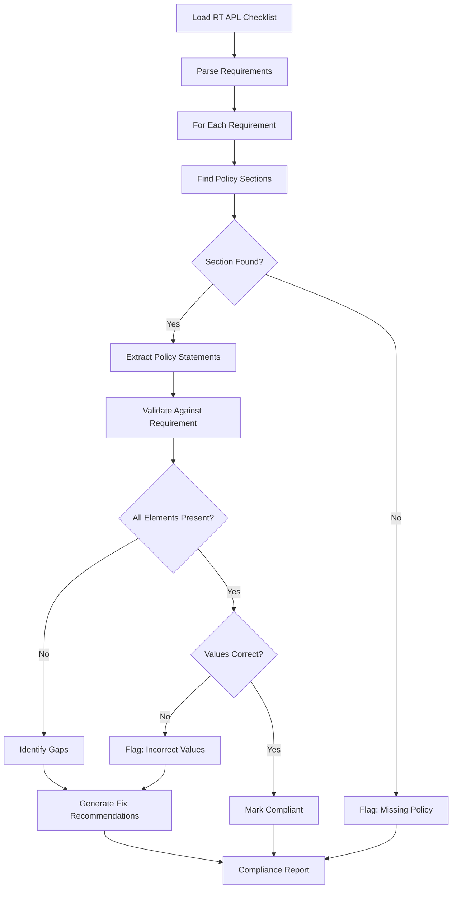

# Policy Compliance Validation Architecture
## System Design for Automated Policy Auditing Against DHCS Review Tools

### Executive Summary
This document outlines the architecture for validating Managed Care Plan (MCP) policies against DHCS MCOD Contract Oversight Branch submission review forms (RT APLs). The system ensures that policies meet all compliance requirements specified in audit checklists by performing detailed cross-referencing and validation.

---

## 1. Understanding the Compliance Challenge

### 1.1 The Three-Layer Compliance Structure
```
┌─────────────────────────────────────────────┐
│         REGULATORY REQUIREMENTS              │
│    (California Laws, Federal Regulations)    │
└─────────────────────┬───────────────────────┘
                      │ References
┌─────────────────────▼───────────────────────┐
│         ALL PLAN LETTERS (APLs)              │
│    (DHCS Policy Directives 23-001, etc.)     │
└─────────────────────┬───────────────────────┘
                      │ Implements
┌─────────────────────▼───────────────────────┐
│      MCP POLICIES & PROCEDURES (P&Ps)        │
│    (Your 746 PDF documents in PNPs folder)   │
└─────────────────────┬───────────────────────┘
                      │ Must Comply With
┌─────────────────────▼───────────────────────┐
│      REVIEW TOOLS (RT APL CHECKLISTS)        │
│    (20 submission review forms)              │
└──────────────────────────────────────────────┘
```

### 1.2 The Validation Challenge
Each RT APL contains specific questions like:
- "Does the P&Ps indicate MCP will submit complete and accurate data... no later than 30 calendar days?"
- Each question references:
  - **Specific APL sections** (e.g., "Reference: APL 23-001, page 3")
  - **Expected policy content** (what the policy MUST state)
  - **Citation requirements** (where in the P&P this is documented)

---

## 2. Proposed Architecture

### 2.1 High-Level System Design
```
┌────────────────────────────────────────────────────────┐
│                   INPUT LAYER                          │
├────────────────────────────────────────────────────────┤
│  Policy PDFs │ RT APL PDFs │ APL References (Web)      │
└──────┬───────┴──────┬──────┴────────┬─────────────────┘
       │              │                │
┌──────▼───────┬──────▼──────┬────────▼─────────────────┐
│              │             │                           │
│   EXTRACTION │   PARSING   │   REFERENCE RESOLUTION   │
│    LAYER     │    LAYER    │        LAYER             │
│              │             │                           │
└──────┬───────┴──────┬──────┴────────┬─────────────────┘
       │              │                │
┌──────▼──────────────▼────────────────▼─────────────────┐
│                                                         │
│           INTELLIGENT VALIDATION ENGINE                 │
│                    (AI-Powered)                         │
│                                                         │
└──────────────────────┬──────────────────────────────────┘
                       │
┌──────────────────────▼──────────────────────────────────┐
│                                                         │
│              COMPLIANCE REPORTING                       │
│                                                         │
└─────────────────────────────────────────────────────────┘
```

### 2.2 Detailed Component Architecture

#### **Component 1: Document Extraction & Parsing**
```python
class RTAPLParser:
    """Parse Review Tool checklists into structured requirements"""
    
    def extract_checklist_items(self, rt_apl_pdf):
        # Extract each numbered question
        # Example: "1) With regard to Annual Network Certification..."
        
        for question in checklist:
            requirement = {
                'question_id': '1a',
                'question_text': 'Does the P&Ps indicate MCP will submit...',
                'apl_reference': 'APL 23-001, page 3',
                'expected_content': [
                    'submit complete and accurate data',
                    'no later than 30 calendar days',
                    'unless extension granted by DHCS'
                ],
                'compliance_type': 'MUST_STATE',
                'section_hint': 'Annual Network Certification'
            }
```

#### **Component 2: Policy Section Mapping**
```python
class PolicySectionMapper:
    """Map policy sections to audit requirements"""
    
    def find_relevant_sections(self, policy, requirement):
        # Strategy 1: Direct section reference
        if requirement.section_hint:
            sections = search_by_title(policy, requirement.section_hint)
        
        # Strategy 2: Keyword matching
        keywords = extract_keywords(requirement.expected_content)
        sections = search_by_keywords(policy, keywords)
        
        # Strategy 3: Semantic similarity (AI)
        sections = semantic_search(policy, requirement.question_text)
        
        return ranked_sections
```

#### **Component 3: Intelligent Validation Engine (AI-Powered)**
```python
class ComplianceValidator:
    """Core validation engine using NLP and AI"""
    
    def validate_requirement(self, policy_section, requirement):
        validation_result = {
            'requirement_id': requirement.question_id,
            'status': 'CHECKING',
            'findings': []
        }
        
        # Step 1: Extract what the policy actually says
        policy_statements = extract_statements(policy_section)
        
        # Step 2: Check for required elements
        for expected_element in requirement.expected_content:
            found = self.check_element_presence(
                policy_statements, 
                expected_element,
                use_semantic_matching=True
            )
            
            if not found:
                validation_result['findings'].append({
                    'type': 'MISSING_REQUIREMENT',
                    'expected': expected_element,
                    'policy_section': policy_section.reference,
                    'severity': 'HIGH'
                })
        
        # Step 3: Check for contradictions
        contradictions = self.check_contradictions(
            policy_statements,
            requirement.expected_content
        )
        
        # Step 4: Verify specific values (dates, timeframes)
        values = self.extract_and_verify_values(
            policy_statements,
            requirement.expected_values
        )
        
        # Determine final status
        if not validation_result['findings']:
            validation_result['status'] = 'COMPLIANT'
        elif any(f['severity'] == 'HIGH' for f in findings):
            validation_result['status'] = 'NON_COMPLIANT'
        else:
            validation_result['status'] = 'PARTIAL_COMPLIANCE'
        
        return validation_result
```

---

## 3. The AI Approach (Why We Need It)

### 3.1 Challenges Requiring AI

1. **Semantic Understanding**: 
   - Policy says: "MCPs shall provide data within thirty (30) days"
   - Requirement: "no later than 30 calendar days"
   - AI understands these are equivalent

2. **Context Resolution**:
   - Requirements reference other sections
   - Policies use different terminology
   - AI can understand relationships

3. **Implicit Compliance**:
   - Policy might comply without exact wording
   - AI can determine if intent is met

### 3.2 Proposed AI Implementation

```python
class AIComplianceEngine:
    def __init__(self):
        # Use specialized models
        self.embedder = SentenceTransformer('legal-bert')
        self.llm = GPT4() # or Claude for analysis
        self.ner = spacy.load('en_legal_ner')
    
    def semantic_compliance_check(self, policy_text, requirement):
        # 1. Create embeddings
        policy_embedding = self.embedder.encode(policy_text)
        requirement_embedding = self.embedder.encode(requirement)
        
        # 2. Calculate similarity
        similarity = cosine_similarity(policy_embedding, requirement_embedding)
        
        # 3. If similarity is borderline, use LLM for detailed analysis
        if 0.6 < similarity < 0.9:
            prompt = f"""
            Requirement: {requirement}
            Policy Text: {policy_text}
            
            Does the policy text comply with the requirement?
            Consider:
            1. Are all required elements present?
            2. Are timeframes and values correct?
            3. Is the intent clearly met?
            
            Respond with: COMPLIANT, NON_COMPLIANT, or NEEDS_CLARIFICATION
            Provide specific reasons.
            """
            
            analysis = self.llm.analyze(prompt)
            return analysis
```

---

## 4. Implementation Approach

### Phase 1: Baseline System (Current Plan)
- PDF extraction ✓
- Database schema ✓
- Basic keyword matching
- Simple compliance scoring

### Phase 2: Enhanced Validation (Recommended Addition)
- **Requirement Parser**: Extract structured requirements from RT APLs
- **Section Matcher**: Map policy sections to requirements
- **Rule Engine**: Check explicit requirements (dates, numbers)
- **Citation Tracker**: Track where compliance is documented

### Phase 3: AI-Powered Intelligence (Critical for Accuracy)
- **Semantic Understanding**: Use embeddings for similarity
- **LLM Analysis**: GPT-4/Claude for complex validation
- **Confidence Scoring**: Provide certainty levels
- **Explanation Generation**: Explain why something is non-compliant

---

## 5. Validation Workflow



---

## 6. Example Validation Process

### Input: RT APL 23-001, Question 1a
```yaml
Requirement:
  ID: "1a"
  Question: "Does the P&Ps indicate MCP will submit complete and accurate data 
            and information to DHCS that reflects the composition of the Network 
            Providers subject to ANC requirements no later than 30 calendar days 
            after receipt of DHCS ANC documents package, unless an extension 
            is granted by DHCS?"
  Reference: "APL 23-001, page 3"
  Expected_Elements:
    - "submit complete and accurate data"
    - "Network Providers"
    - "ANC requirements"
    - "30 calendar days"
    - "after receipt of DHCS ANC documents"
    - "extension granted by DHCS"
```

### Process:
1. **Find Policy Section**: Search for "Annual Network Certification"
2. **Extract Text**: Get relevant paragraphs
3. **Validate Elements**:
   - ✓ Found: "complete and accurate data" 
   - ✓ Found: "30 calendar days"
   - ✗ Missing: "extension granted by DHCS"
4. **Result**: NON_COMPLIANT - Missing extension clause

### Output:
```json
{
  "requirement_id": "RT_APL_23_001_Q1a",
  "policy": "AA.1207_Network_Adequacy.pdf",
  "status": "NON_COMPLIANT",
  "gaps": [
    {
      "missing": "Reference to DHCS extension provision",
      "recommendation": "Add clause: 'unless an extension is granted by DHCS'",
      "location": "Section 3.2.1"
    }
  ],
  "confidence": 0.92
}
```

---

## 7. Technology Stack Recommendation

### Core Technologies
- **Python 3.11+**: Main language
- **PostgreSQL**: Structured data + pgvector for embeddings
- **Redis**: Caching validation results

### AI/ML Components
- **LangChain**: Orchestrate LLM workflows
- **OpenAI GPT-4** or **Anthropic Claude**: Complex analysis
- **Sentence Transformers**: Create embeddings
- **spaCy**: NLP processing

### Specific Libraries
```python
# requirements.txt additions
langchain==0.1.0
openai==1.0.0
anthropic==0.8.0
sentence-transformers==2.2.2
pgvector==0.2.3
chromadb==0.4.22  # Vector database
```

---

## 8. Benefits of This Approach

1. **Automated Compliance Checking**: No manual review needed
2. **Precise Gap Identification**: Exact requirements missing
3. **Actionable Recommendations**: Specific fixes provided
4. **Audit Trail**: Complete documentation of checks
5. **Continuous Monitoring**: Re-validate when policies change
6. **Risk Scoring**: Prioritize high-severity issues

---

## 9. Conclusion

The proposed system combines:
- **Structured parsing** of review tools
- **Intelligent matching** of requirements to policies  
- **AI-powered validation** for semantic understanding
- **Detailed reporting** of compliance gaps

This ensures that every policy fully complies with all audit tool requirements, with clear documentation of where compliance is demonstrated and specific guidance on addressing any gaps.

### Next Steps
1. Implement requirement parser for RT APLs
2. Build validation rule engine
3. Integrate AI for semantic analysis
4. Create compliance dashboard
5. Generate automated fix recommendations